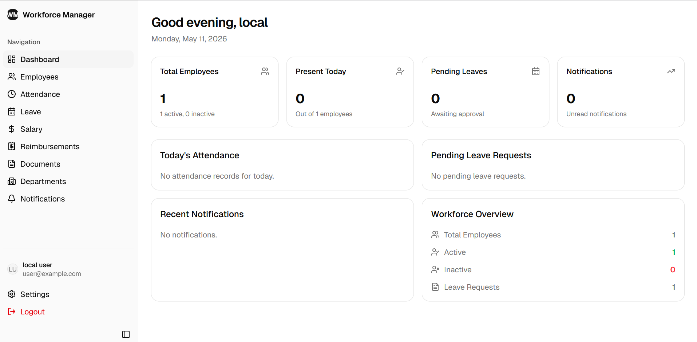
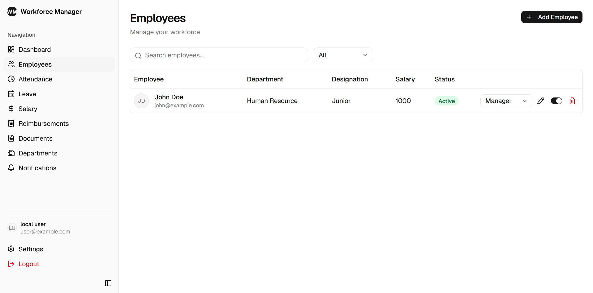
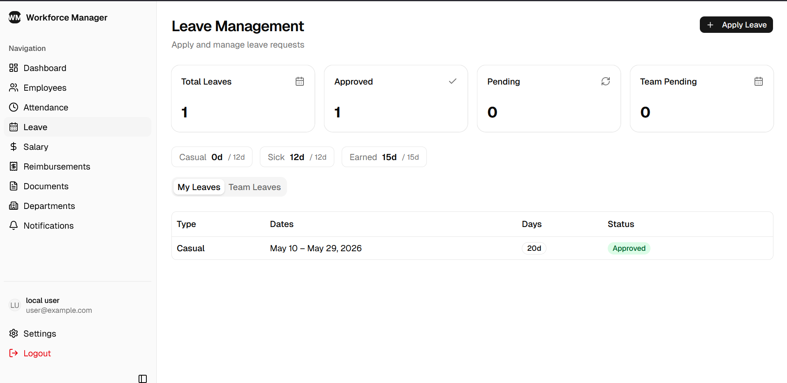
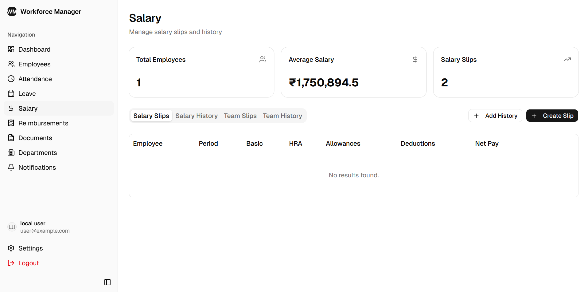

# Workforce Manager

> ⚠️ **Note:** This project is currently under active development.

A complete workforce management solution featuring an admin panel, employee tracking, leave management, and salary processing.

## 📸 Screenshots

### Admin Panel


### Employee Management


### Leave Management


### Salary Processing


## 🚀 Getting Started

### Prerequisites
- [uv](https://github.com/astral-sh/uv) (for the backend)
- [bun](https://bun.sh/) (for the web frontend)

### Running the Backend

Navigate to the `backend` directory and start the server using `uv`:

```bash
cd backend
uv run .\main.py
```

### Running the Web Frontend

Navigate to the `web` directory and start the development server using `bun`:

```bash
cd web
bun run dev
```