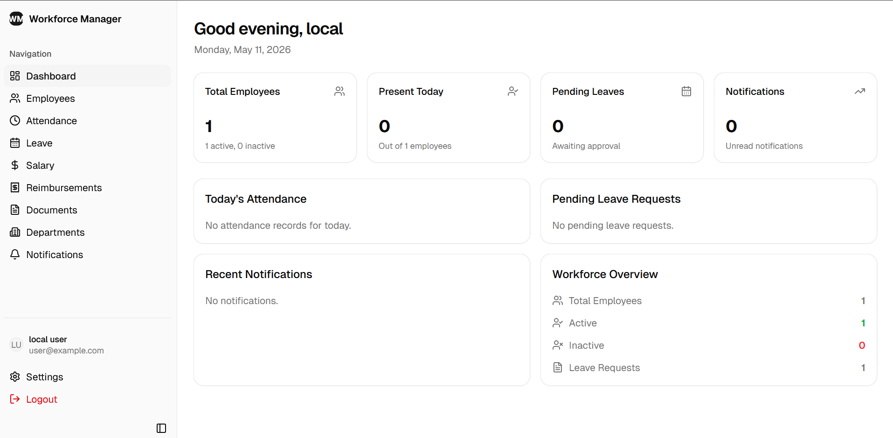
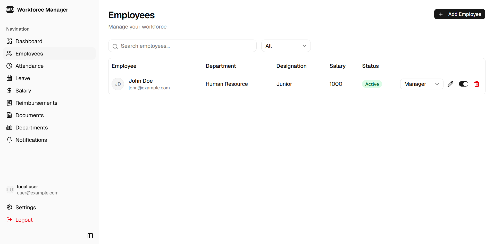
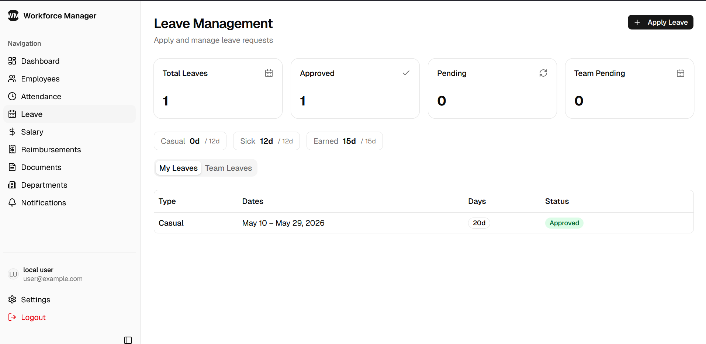
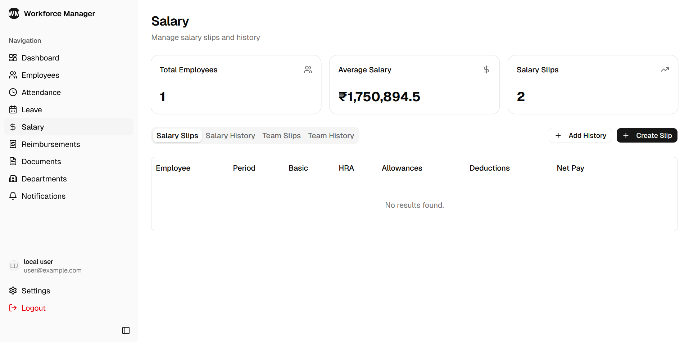

# Workforce Manager

> ⚠️ **Note:** This project is currently under active development.

A complete workforce management solution featuring an admin panel, employee tracking, leave management, and salary processing.

## 📸 Screenshots

### Admin Panel


### Employee Management


### Leave Management


### Salary Processing


## 🚀 Getting Started

### Option 1: Running with Docker (Recommended)

Run the entire application (FastAPI backend + React frontend + SQLite database) with a single command:

```bash
docker compose up --build
```

- **Frontend**: Accessible at [http://localhost:3000](http://localhost:3000)
- **Backend API**: Accessible at [http://localhost:8000](http://localhost:8000)
- **Interactive API Docs**: [http://localhost:8000/docs](http://localhost:8000/docs)

To run in the background:
```bash
docker compose up -d
# or using Makefile:
make up
```

To stop containers:
```bash
docker compose down
# or using Makefile:
make down
```

You can view all available Makefile helper commands by running:
```bash
make help
```

---

### Option 2: Running Locally (Development)

#### Prerequisites
- [uv](https://github.com/astral-sh/uv) (for the backend)
- [bun](https://bun.sh/) (for the web frontend)

#### Running the Backend

Navigate to the `backend` directory and start the server using `uv`:

```bash
cd backend
uv run main.py
```

#### Running the Web Frontend

Navigate to the `web` directory and start the development server using `bun`:

```bash
cd web
bun run dev
```